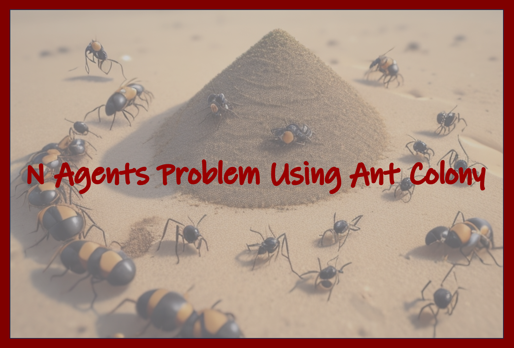

# N Agents Problem Using Ant Colony Optimization

This project focuses on solving the assignment problem using Colony Optimization with Python. The assignment problem involves assigning n agents to n tasks while minimizing the total cost of the assignment. Each agent can be assigned to perform any task, incurring a specific cost, and the goal is to find the assignment that minimizes the total cost.

## Problem Description

The problem instances consist of an n×n cost matrix M, where Mi,j represents the cost of assigning the i-th task to the j-th agent. The objective is to minimize the sum of these costs while ensuring that each task is assigned to exactly one agent and vice versa.

## Code Overview

**Parameters:**
- `n`: The number of agents/tasks.
- `best_cost`: The target cost to achieve.
- `evaporation_rate`: The rate at which pheromone evaporates.
- `alfa` and `beta`: Parameters affecting the probability calculation.
- `ant_number`: The number of ants in the colony.
- `best_ant_cost`: The best cost found by the algorithm.
- `best_ant_path`: The corresponding assignment path.
- `data`: The cost matrix read from the input file.

The code begins by reading the cost matrix from the input file. It initializes pheromone levels, creates ant objects, and guides the ants in constructing assignment paths based on pheromone levels and cost considerations.

## Parameters and Pheromone Update

- `alfa` and `beta` parameters control the probability of selecting a task for assignment. Adjusting these parameters influences the balance between exploration and exploitation.
- Pheromone levels are updated based on the quality of the solutions found by ants. Higher quality solutions contribute to increased pheromone levels.

## Convergence

The algorithm iteratively constructs assignment paths using multiple ants, updates pheromone levels, and performs evaporation. It continues this process until the best cost achieved is close to the target cost.

## Performance and Learnings

- The performance of the code is influenced by parameters such as `alfa`, `beta`, and the evaporation rate.
- The algorithm explores the solution space efficiently and is capable of finding optimal or near-optimal solutions.
- Monitoring the convergence behavior, including the number of iterations required to reach a satisfactory solution, is crucial for assessing the algorithm's efficiency.

## Test Cases

To validate the code, test cases with different matrix sizes and target costs are provided. The code is expected to find solutions with costs less than the specified targets for each test case.

